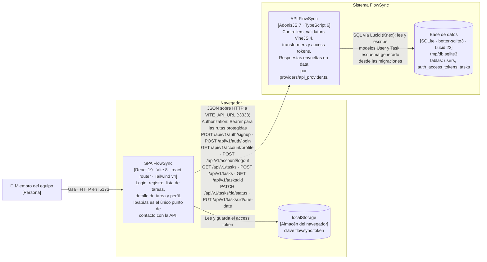

# Arquitectura de FlowSync — diagrama de contenedores (C4 nivel 2)

Este diagrama muestra las piezas desplegables de FlowSync y cómo se hablan entre sí: una SPA de React que se sirve con Vite en `localhost:5173`, una API de AdonisJS en `localhost:3333` y el fichero SQLite `backend/tmp/db.sqlite3` al que esa API accede por Lucid. La SPA guarda el access token en `localStorage` y lo manda en cada llamada como `Authorization: Bearer`; todas las rutas cuelgan de `/api/v1` y devuelven el payload envuelto en `{ data }`. Solo aparece lo que está en el código: las rutas de `backend/start/routes.ts`, las tablas creadas por las migraciones y las llamadas que hace `frontend/src/lib/api.ts`, que es el único módulo del frontend que toca la red.

