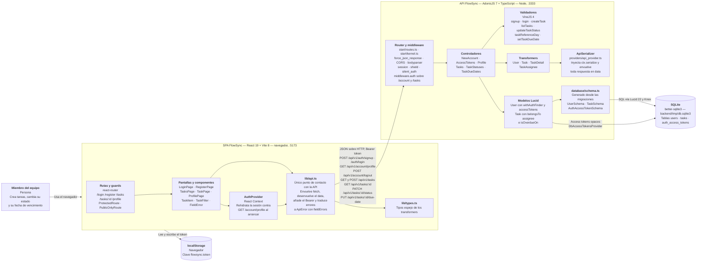

# Arquitectura de FlowSync — diagrama de contenedores (C4 nivel 2)

Este diagrama muestra las tres piezas ejecutables de FlowSync y cómo se hablan entre sí: la SPA de React que corre en el navegador, la API de AdonisJS y el fichero SQLite donde vive todo el estado. Dentro de cada contenedor se dibujan solo los bloques que existen hoy en el código (`frontend/src/`, `backend/app/`, `backend/start/`, `backend/database/`), y las flechas entre contenedores llevan el protocolo y las rutas reales declaradas en `backend/start/routes.ts` y consumidas desde `frontend/src/lib/api.ts`. No aparece nada que no se pueda verificar leyendo el repositorio: no hay proxy inverso, ni caché, ni cola, ni servicios externos, y el guard `web` de sesión, aunque está configurado en `config/auth.ts`, no lo usa ninguna ruta, así que tampoco se dibuja.

## Notas de lectura

- **La URL de la API es configurable**: `frontend/src/lib/api.ts` la toma de `VITE_API_URL` y cae a `http://localhost:3333` si no está definida.
- **Autenticación por token de API**: el guard por defecto en `config/auth.ts` es `api` (tokens opacos en `auth_access_tokens`). El navegador guarda ese token en `localStorage` bajo `flowsync.token` y lo manda como `Authorization: Bearer` en cada llamada.
- **El vencimiento se decide en el servidor**: el cliente manda su día local (`today`, `AAAA-MM-DD`) y `Task.isOverdueOn()` resuelve `isOverdue`; el frontend nunca compara fechas.
- **Toda respuesta pasa por un transformer y por `serialize()`**, de modo que el cuerpo siempre llega envuelto en `{ data: ... }`.
- **El esquema no se escribe a mano**: las migraciones de `database/migrations/` generan `database/schema.ts`, y los modelos extienden esas clases.
