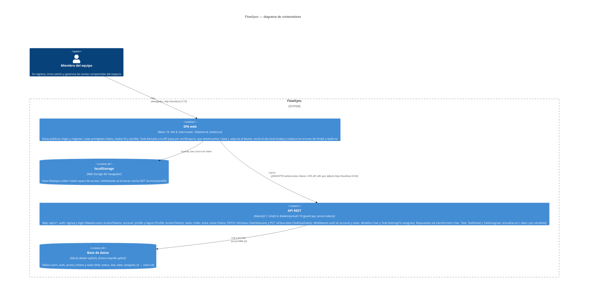

# Arquitectura de FlowSync — diagrama de contenedores (C4, nivel 2)

El diagrama muestra los contenedores que existen hoy en el repositorio y cómo se comunican: una SPA de React (`frontend/`) que guarda el token de sesión en el `localStorage` del navegador y habla con la API de AdonisJS (`backend/`) mediante JSON bajo `/api/v1`, con `Authorization: Bearer`; y la API, que valida con VineJS, persiste con Lucid en un único fichero SQLite (`tmp/db.sqlite3`) y responde siempre a través de transformers envueltos en `{ data }`. Se ha construido solo a partir de lo que se puede leer en `start/routes.ts`, `start/kernel.ts`, `app/`, `config/`, `database/migrations/` y `frontend/src/`. Por eso no aparecen la guard `web` de sesión ni las conexiones de Postgres, MySQL u otras: están configuradas o comentadas, pero ningún código las usa.

```mermaid
C4Container
  title FlowSync — diagrama de contenedores

  Person(member, "Miembro del equipo", "Se registra, inicia sesión y gestiona las tareas compartidas del espacio")

  System_Boundary(flowsync, "FlowSync") {

    Container(spa, "SPA web", "React 19, Vite 8, react-router, Tailwind v4, shadcn/ui", "Rutas públicas /login y /register; rutas protegidas /tasks, /tasks/:id y /profile. Toda llamada a la API pasa por src/lib/api.ts, que desenvuelve { data }, adjunta el Bearer, envía el día local (today) y traduce los errores de VineJS a ApiError")

    ContainerDb(storage, "localStorage", "Web Storage del navegador", "Clave flowsync.token: token opaco de acceso, rehidratado al arrancar contra GET /account/profile")

    Container(api, "API REST", "AdonisJS 7, VineJS 4, @adonisjs/auth 10 (guard api, access tokens)", "Bajo /api/v1. auth: signup y login (NewAccount, AccessTokens). account: profile y logout (Profile, AccessTokens). tasks: index, store, show (Tasks), PATCH :id/status (TaskStatuses) y PUT :id/due-date (TaskDueDates). Middleware auth en account y tasks. Modelos User y Task (belongsTo assignee). Respuestas vía transformers User, Task, TaskDetail y TaskAssignee, envueltas en { data } por serialize()")

    ContainerDb(db, "Base de datos", "SQLite (better-sqlite3), fichero tmp/db.sqlite3", "Tablas users, auth_access_tokens y tasks (title, status, due_date, assignee_id → users.id)")
  }

  Rel(member, spa, "Usa", "Navegador, http://localhost:5173")
  Rel(spa, storage, "Guarda, lee y borra el token")
  Rel(spa, api, "Llama", "JSON/HTTP, Authorization: Bearer, VITE_API_URL (por defecto http://localhost:3333)")
  Rel(api, db, "Lee y escribe", "Lucid ORM 22")

  UpdateLayoutConfig($c4ShapeInRow="2", $c4BoundaryInRow="1")
```
