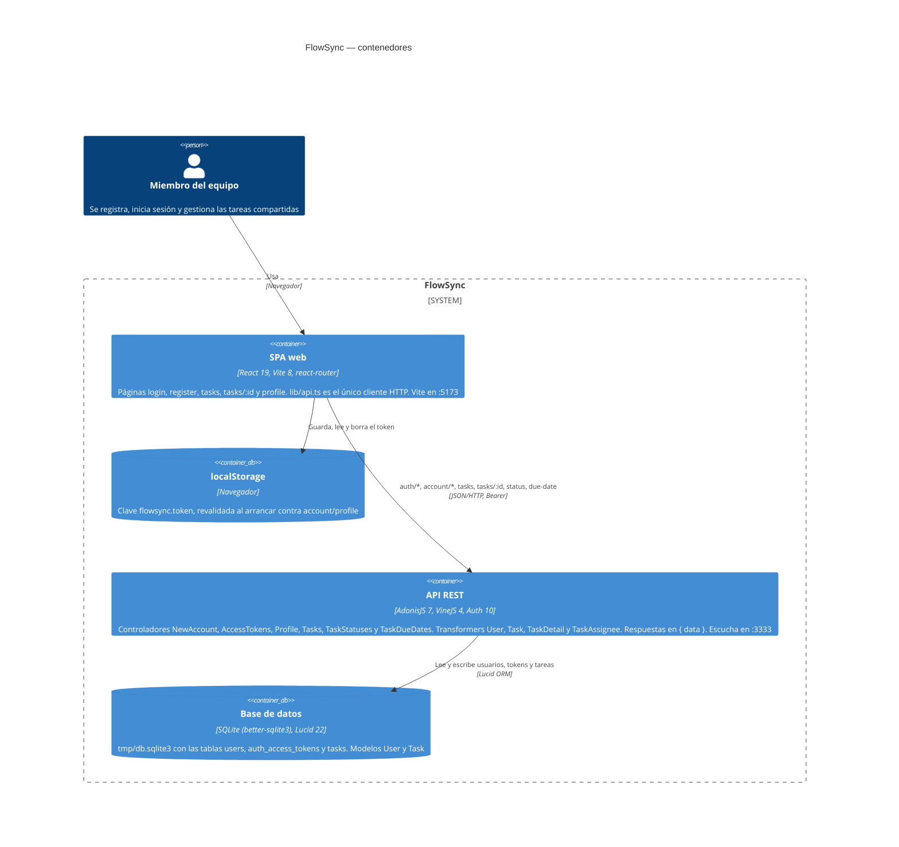

# Arquitectura de FlowSync — diagrama de contenedores (C4)

El diagrama muestra los contenedores de FlowSync tal y como están en el código hoy. Una SPA en React (`frontend/`) habla con una API AdonisJS (`backend/`) mediante JSON sobre HTTP bajo `/api/v1`. La API autentica con access tokens opacos (guard `api`), que la SPA guarda en `localStorage` y manda como `Authorization: Bearer`. Los datos van a un único fichero SQLite a través de Lucid. Cada contenedor indica las piezas que contiene (controladores, transformers, modelos, tablas). No aparece nada que no esté en el repositorio: no hay servicios externos, colas, caché, email ni entorno de despliegue configurado. Los puertos son los de desarrollo.

```mermaid
C4Container
    title FlowSync — contenedores

    Person(member, "Miembro del equipo", "Se registra, inicia sesión y gestiona las tareas compartidas")

    System_Boundary(flowsync, "FlowSync") {
        Container(spa, "SPA web", "React 19, Vite 8, react-router", "Páginas login, register, tasks, tasks/:id y profile. lib/api.ts es el único cliente HTTP. Vite en :5173")
        ContainerDb(tokenStore, "localStorage", "Navegador", "Clave flowsync.token, revalidada al arrancar contra account/profile")
        Container(api, "API REST", "AdonisJS 7, VineJS 4, Auth 10", "Controladores NewAccount, AccessTokens, Profile, Tasks, TaskStatuses y TaskDueDates. Transformers User, Task, TaskDetail y TaskAssignee. Respuestas en { data }. Escucha en :3333")
        ContainerDb(db, "Base de datos", "SQLite (better-sqlite3), Lucid 22", "tmp/db.sqlite3 con las tablas users, auth_access_tokens y tasks. Modelos User y Task")
    }

    Rel(member, spa, "Usa", "Navegador")
    Rel(spa, tokenStore, "Guarda, lee y borra el token")
    Rel(spa, api, "auth/*, account/*, tasks, tasks/:id, status, due-date", "JSON/HTTP, Bearer")
    Rel(api, db, "Lee y escribe usuarios, tokens y tareas", "Lucid ORM")

    UpdateLayoutConfig($c4ShapeInRow="2", $c4BoundaryInRow="1")
```
