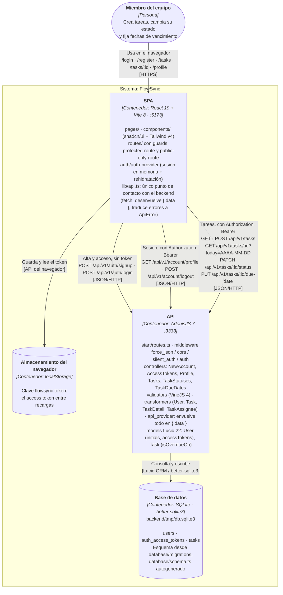

# Arquitectura

Diagrama de contenedores (C4 nivel 2) de FlowSync. Muestra las piezas que se
despliegan y se ejecutan por separado —la SPA de React, la API de AdonisJS y el
fichero SQLite— y las llamadas reales que van de una a otra, con los endpoints
tal y como están declarados en `backend/start/routes.ts` y consumidos desde
`frontend/src/lib/api.ts`. Dentro de cada contenedor se anotan los módulos que
existen hoy en el código, no una estructura prevista: si algo no aparece
(caché, colas, servicios externos, un segundo cliente) es porque no está en el
repositorio. El almacenamiento del navegador se dibuja aparte porque es donde
vive el token de sesión entre recargas, y eso condiciona el arranque de la SPA.

## Notas de lectura

- **La URL de la API es configurable**: la SPA la toma de `VITE_API_URL` y cae
  a `http://localhost:3333` si no está definida (`frontend/src/lib/api.ts`).
- **La autenticación es por access tokens opacos**, no por sesión de navegador.
  El guard por defecto de `backend/config/auth.ts` es `api`
  (`DbAccessTokensProvider` sobre `auth_access_tokens`); el guard `web` está
  configurado pero ninguna ruta lo usa.
- **`silent_auth_middleware` corre en todas las rutas**; la protección efectiva
  la aplica `middleware.auth()` sobre los grupos `account` y `tasks`.
- **Toda respuesta pasa por `serialize()`** (`backend/providers/api_provider.ts`),
  que envuelve el payload en `{ data: ... }`; `lib/api.ts` lo desenvuelve en el
  cliente.
- **El día de referencia viaja del cliente al servidor** (`?today=` y en el
  cuerpo de la fecha de vencimiento): la SPA lo calcula con la hora local del
  navegador y el backend decide con él si una tarea está vencida
  (`Task.isOverdueOn`). No hay reloj de servidor en esa decisión.
- **No hay registro tipado en el camino real**: `backend/.adonisjs/client/registry/`
  (Tuyau) está generado y versionado, pero el frontend no lo consume — solo lo
  usa `backend/tests/bootstrap.ts` para tipar el `apiClient` de Japa.
